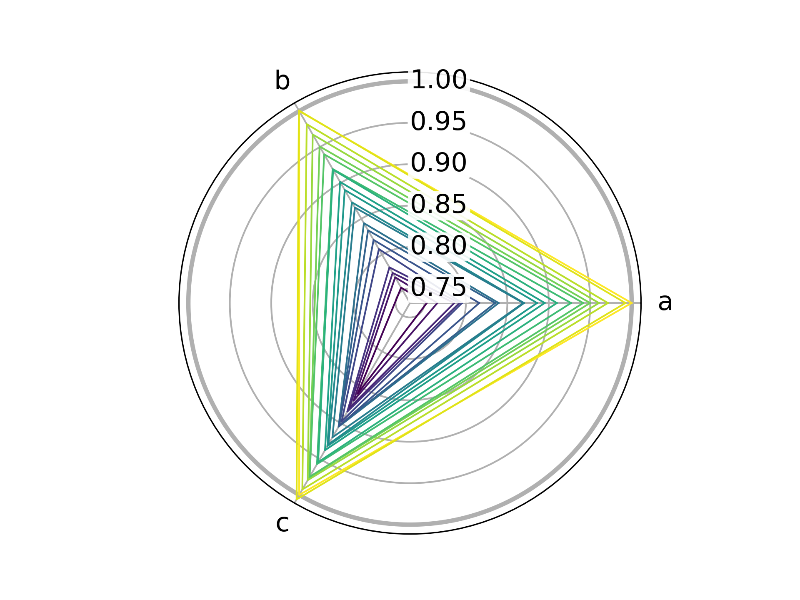
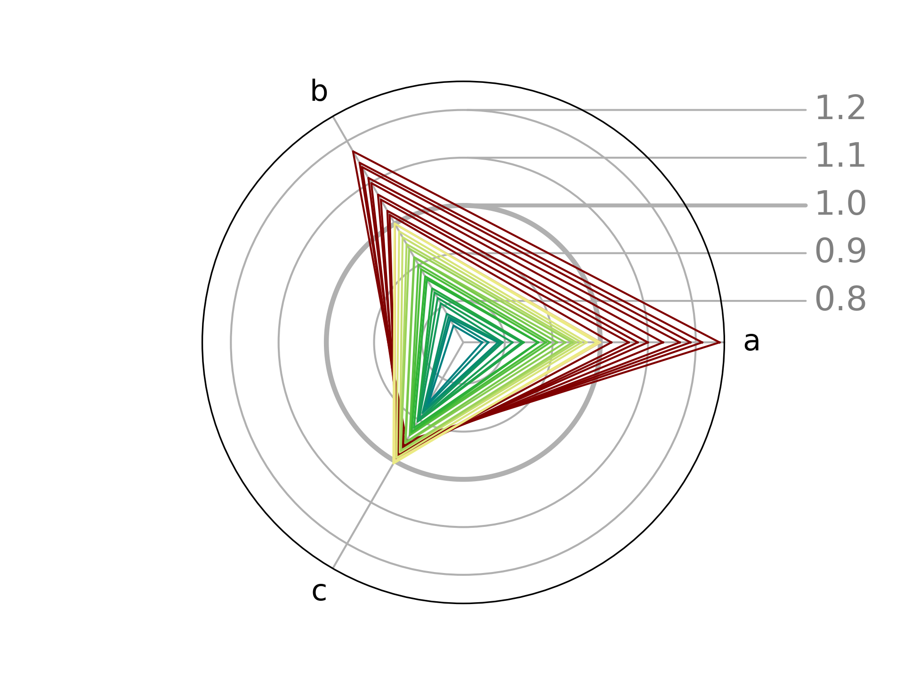

# ChARd
Python script for quick and attractive Changes of Anisotropy RaDial (ChARd)
plots, as introduced by Michał Kaźmierczak*, Ewa Patyk-Kaźmierczak,
and Andrzej Katrusiak in https://doi.org/10.1021/acs.cgd.0c01636.
The file can be used as a stand-alone command-line script or a python library.
In either case it requires Python version 3.8+ with libraries
`numpy`, `pandas`, `matplotlib` installed. See also [LICENSE](LICENSE) file.

# Usage as a command line tool
In order to plot a chard plot, you need an input file, which needs to be
either a "raw" file with three unnamed columns standing for a, b, c
in this exact order (see [examples/raw.csv](examples/raw.csv))
or a "named" file with column names in first row including columns named
"a", "b", "c" and any other such as "p" or "T"
(see [examples/named.csv](examples/named.csv)).
The file can be either a csv or any spreadsheet supported by your version
of pandas (xls, ods, xlrd, pyxlsb for pandas 1.2+, + openpyxl for 1.3+).
It is suggested to use a "named" format (with named columns),
as it allows more flexibility.

The simplest ChARd can be generated using command:

    python chard.py -i examples/raw.csv

where `-i` points to the input file.
Flag `-i` can be specified multiple times to plot multiple files together.
In general, the following flags may be specified multiple times,
once for each ChARd series:

- `-i`, `--input` - Path to input file with a single series to plot;
- `-s`, `--sheet` - If importing from spreadsheet, name of the sheet with data;
- `-c`, `--color` - Color, colon-separated series of colors, or colormap
  to be used for plotting series, can be sliced (see docstring for full desc.);
- `-n`, `--normalizer` - Index or values to normalize abc to, if needed;
  `0` will normalize to 1st entry,
  while `12.4,6.5,30.4` will normalize to these values.
- `-e`, `--emphasis` - Name of the column with information about emphasis,
  plot as darkening of color or progress on colormap.
  Prefix the name with "@" to reverse the order.

The following flags may be specified once and affect the final figure:
- `-o`, `--output` - If given, save the figure under this name instead
  of plotting it in an interactive mode.
- `-w`, `--linewidth` - Width of the lines used to plot series (default 1).
- `-l`, `--labelsize` - Size of the axis and grid line labels (default 15).

## Examples

The plots present in directory [images](images) have been generated using
the commands listed below. If you want to try yourself, you are advised to
change the output path not to overwrite the original figures:

### Example 1 – simple colored ChARd plot

    python chard.py -i examples/raw.csv -c red -n "10,10,10" -o images/raw.png

This plot is based on data in [examples/raw.csv](examples/raw.csv),
colored red, and normalized to absolute values of a=10, b=10, c=10.
The figure was then saved in `images` as `raw.png`.

### Example 2 – ChARd plot with pressure emphasized using color

    python chard.py -i examples/named.csv -c viridis -e @p -n 0 -o images/named.png

This plot is based on data in [examples/named.csv](examples/named.csv), which
apart from information about unit cell axes contains also pressure values.
Instead of using a single color, various colors are probed from the matplotlib
viridis colormap (`-c viridis`) based on the values stored in column p
in reversed order (`-e @p`). All values are normalized to those from the first
row (`-n 0`), and the width of plotted lines is slightly increased (`-w 1.5`).

### Example 3 – ChARd plot with multiple series

    python chard.py -i examples/raw.csv -c "#800000" -e p -n "-1" \
                    -i examples/named.csv -c khaki:teal -e p -n 0 \
                    -o images/combined.png

While the previous plots were prepared using a single series each,
multiple series can be provided by specifying `-i` (and other necessary flags)
multiple times. As a result, this plot is based on data from both
[examples/raw.csv](examples/raw.csv) and
[examples/named.csv](examples/named.csv).
The first dataset is drawn in dark red given with a hex code (`-c "#800000"`),
while the second one is drawn in colors spanning from "khaki" to "teal"
(`-c khaki:teal`). The emphasis on both plots comes from column "p" (`-e p`),
though this information is naturally absent in the first "raw" dataset
which features no "p"-named column.
Finally, the unit cell parameters are normalized to the last value in `raw.csv`
(`-n "-1"`) and to the first value in `named.csv` (`-n 0`).

# Usage as a python library

In order to use the chard-style matplotlib axis as a library,
the [chard.py](chard.py) file needs only to be imported.
The `ChardAxes` class will be auto-registered as a custom projection
named `chard` in `matplotlib`. The axes can be then for example using
`fig, ax = plt.subplots(subplot_kw=dict(projection='chard'))`.

In this `chard` projection, individual lines can be plotted as normal using
`ax.plot()`, where `x` must be skipped and only a 3-long list `y`
(and any desired keywords) need to be provided.
However, it is much more convenient to also `from chard import ChardSeries`
and use a custom method `ax.plot_series()` to plot entire series with
a single command.

For further details, please refer to doc strings in the file itself.
For a rudimentary example, see `example()` function.
